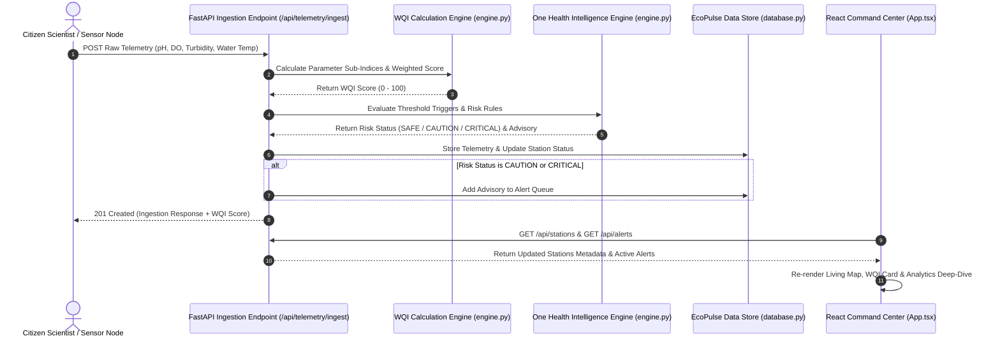

# 🌊 EcoPulse — Citizen-Science Freshwater Monitoring & One Health Intelligence Platform

> **Transforming raw freshwater quality observations into actionable ecological and public health intelligence.**

[](https://github.com/varshithaaaagedda/eco-pulse)
[](https://github.com/varshithaaaagedda/eco-pulse)
[](https://fastapi.tiangolo.com/)
[](https://react.dev/)
[](https://vitejs.dev/)
[](LICENSE)
[](test_backend.py)

---

## 📌 Problem

Citizen science initiatives and local monitoring stations collect vast amounts of freshwater telemetry (pH, dissolved oxygen, turbidity, water temperature). However, interpreting this raw data presents critical challenges:

* **Raw Data Complexity**: Non-expert citizens and municipal authorities struggle to evaluate isolated numerical parameters without context.
* **Delayed Risk Detection**: Manual sampling schedules and fragmented data delay the detection of sudden agricultural runoff or industrial effluent spikes.
* **Lack of Actionable Health Insights**: Traditional tools display charts but fail to provide immediate, plain-language **One Health** advisories and field response actions.

---

## 💡 Solution

**EcoPulse** bridges the gap between raw freshwater observations and environmental action through an end-to-end data processing pipeline:

$$\text{Citizen / Sensor Data} \longrightarrow \text{Validation \& Storage} \longrightarrow \text{WQI Risk Scoring} \longrightarrow \text{Time-Series Anomaly Detection} \longrightarrow \text{Geospatial Visualization} \longrightarrow \text{One Health Insights}$$

EcoPulse automatically computes a normalized **Water Quality Index (WQI)** (0–100), detects statistical outliers using rolling time-series analysis, and outputs human-readable ecological briefings for rapid decision-making.

---

## 🌟 Why EcoPulse?

* **Data-to-Insight Approach**: Converts raw multi-metric stream observations into a single intuitive health index paired with plain-language action items.
* **One Health Framework**: Connects aquatic biological stability with public health and animal welfare (e.g., downstream agricultural irrigation warnings).
* **Interactive Command Center**: Combines dynamic HTML5 Canvas hydrographic map rendering with live parameter deep-dives and crowdsourced citizen submission tools.

---

## 🔥 Core Features

| Feature | Description | Implementation Status |
| :--- | :--- | :---: |
| **🗺️ Geospatial Water-Quality Map** | Interactive Canvas GIS map with hydrographic stream flows, flow velocity particles, thermal risk heatmaps, and station nodes (`ST-01` to `ST-05`). | ✅ **Fully Implemented** |
| **📊 WQI Health Scoring Engine** | Multi-variable weighted scoring algorithm normalizing pH, Dissolved Oxygen, Turbidity, and Water Temperature onto a 0–100 scale. | ✅ **Fully Implemented** |
| **🚦 Dynamic Risk Classification** | Automated status mapping to **`SAFE`** (Green), **`CAUTION`** (Yellow), and **`CRITICAL`** (Red) hazard levels. | ✅ **Fully Implemented** |
| **📈 Statistical Anomaly Detection** | Pandas & NumPy engine identifying time-series statistical outliers ($Z$-score $> 2.0$) across rolling historical telemetry windows. | ✅ **Fully Implemented** |
| **🩺 One Health Insight Generator** | Automated generation of biological threat briefings, agricultural runoff warnings, and recommended field actions. | ✅ **Fully Implemented** |
| **🔍 Station Analytics Deep-Dive** | Interactive metric inspector for detailed station diagnostics with Chart.js time-series graphs. | ✅ **Fully Implemented** |
| **🧪 Interactive Risk Surge Simulator** | One-click simulation injecting synthetic pollution spikes (high turbidity, low DO) to test real-time alert streaming. | ✅ **Fully Implemented** |
| **📡 Citizen Science Telemetry Upload** | Modal interface for community members to submit manual stream observations directly into the platform. | ✅ **Fully Implemented** |
| **🚀 Operational Field Unit Dispatch** | Tactical dispatch modal to deploy autonomous hydro-drones or field sampling squads to high-risk stations. | ✅ **Fully Implemented** |

---

## 🖥️ Dashboard Overview

The EcoPulse Command Center interface (`src/App.tsx`) is organized into intuitive, high-impact operational modules:

1. **Header Command Bar (`Header.tsx`)**: Displays live system operational status (`SYSTEM ONLINE // LIVE FEED`), real-time UTC/Local clocks, **Export GIS Telemetry** button (GeoJSON download), and **Simulate Risk Surge** simulation toggle.
2. **Left Navigation Sidebar (`Sidebar.tsx`)**: Quick access to Dashboard, Sentinel Analytics, Alert Feed counter, Reports, and Settings.
3. **Geospatial GIS Living Map (`LivingMap.tsx`)**: HTML5 Canvas map featuring dark-matter vector hydrography, animated stream flow velocity particles, thermal risk heatmap glows, tactical hex grid toggles, and station node pins (`ST-01` to `ST-05`) with live mini WQI meter bars.
4. **Global Basin Health Score Card (`HealthScoreCard.tsx`)**: Displays the aggregate average basin WQI score, 7-day health trend percentage, and active alert severity breakdown.
5. **Automated One Health Alert Feed (`AlertFeed.tsx`)**: Real-time streaming stack of ecological risk advisories with severity badges, metric triggers, and one-click **Acknowledge**, **Dispatch Squad**, and **Locate on Map** controls.
6. **Station Deep-Dive Analytics (`StationDeepDive.tsx`)**: Station selector pills, real-time parameter grid (pH, DO, Turbidity, Temp) with reference bounds, and Chart.js historical trend graphs.
7. **Footer Ticker & Citizen Upload (`FooterTicker.tsx` & `CitizenUploadModal.tsx`)**: Live scrolling ticker of citizen observations with a **Submit Observation** modal form.
8. **Field Squad Dispatch (`DispatchModal.tsx`)**: Tactical popup to dispatch field teams or autonomous hydro-drones to flagged stations.

---

## 🏗️ System Architecture

EcoPulse uses a decoupled full-stack architecture cleanly separating API routing, data validation, intelligence computation, and frontend visualization.

```mermaid
graph TD
    subgraph Client Layer (React 19 + TypeScript + Vite)
        UI[App.tsx Command Center] --> MAP[LivingMap.tsx - HTML5 Canvas GIS Engine]
        UI --> SCORE[HealthScoreCard.tsx - Basin WQI Aggregate]
        UI --> ALERTS[AlertFeed.tsx - One Health Advisory Stack]
        UI --> DIVE[StationDeepDive.tsx - Chart.js Analytics]
        UI --> MODAL[CitizenUploadModal.tsx - Crowdsourced Ingestion]
    end

    subgraph Backend Layer (FastAPI v0.100+ + Python 3.11)
        API[main.py - REST Endpoints] --> SCHEMAS[models.py - Pydantic V2 Schemas]
        API --> DB[database.py - Thread-Safe Store & SQLite]
        API --> ENGINE[engine.py - WQI & Intelligence Engine]
    end

    subgraph Intelligence Engine
        ENGINE --> WQI_CALC[WQI Score Calculation Engine]
        ENGINE --> ANOMALY[Pandas & NumPy Z-Score Anomaly Engine]
        ENGINE --> BRIEFING[One Health Risk Briefing Generator]
    end

    MODAL -->|POST /api/telemetry/ingest| API
    UI -->|GET /api/stations & /api/alerts| API
    WQI_CALC -->|WQI Score| BRIEFING
    ANOMALY -->|Statistical Outliers| BRIEFING
    BRIEFING -->|Alert Item| DB
```

---

## 🔄 Data Flow Pipeline



---

## 📐 Water Quality Intelligence & WQI Scoring

The **Water Quality Index (WQI)** normalizes 4 critical chemical and physical parameters onto a standardized **0 to 100** score:

### 1. Mathematical Formulation
$$\text{WQI}_{\text{raw}} = \left(0.40 \times S_{\text{DO}}\right) + \left(0.35 \times S_{\text{Turbidity}}\right) + \left(0.25 \times S_{\text{pH}}\right) - P_{\text{Temp}}$$

$$\text{WQI}_{\text{final}} = \max\left(0.0, \min\left(100.0, \text{WQI}_{\text{raw}}\right)\right)$$

### 2. Parameter Sub-Index Calculations (`engine.py`)

| Parameter | Weight | Ideal Reference | Calculation Logic |
| :--- | :---: | :---: | :--- |
| **Dissolved Oxygen (DO)** | **40%** | $\ge 7.0 \text{ mg/L}$ | • $\text{DO} \ge 7.0 \implies \min(100, 80 + (\text{DO} - 7) \times 4)$<br>• $5.0 \le \text{DO} < 7.0 \implies 50 + (\text{DO} - 5) \times 15$<br>• $3.5 \le \text{DO} < 5.0 \implies 20 + (\text{DO} - 3.5) \times 20$<br>• $\text{DO} < 3.5 \implies \max(0, \text{DO} \times 5.7)$ |
| **Turbidity** | **35%** | $\le 5.0 \text{ NTU}$ | • $\text{Turb} \le 5.0 \implies 100.0$<br>• $5.0 < \text{Turb} \le 25.0 \implies 100 - \left(\frac{\text{Turb} - 5}{20}\right) \times 35$<br>• $25.0 < \text{Turb} \le 45.0 \implies 65 - \left(\frac{\text{Turb} - 25}{20}\right) \times 35$<br>• $\text{Turb} > 45.0 \implies \max\left(0, 30 - \left(\frac{\text{Turb} - 45}{50}\right) \times 30\right)$ |
| **pH Level** | **25%** | $6.5 - 8.5$ | • $6.5 \le \text{pH} \le 8.5 \implies 100 - \left(\frac{|\text{pH} - 7.2|}{1.3}\right) \times 15$<br>• $\text{pH} < 6.5 \implies \max\left(0, 100 - \left(\frac{6.5 - \text{pH}}{2.5}\right) \times 80\right)$<br>• $\text{pH} > 8.5 \implies \max\left(0, 100 - \left(\frac{\text{pH} - 8.5}{2.5}\right) \times 80\right)$ |
| **Water Temperature** | **Penalty** | $5.0 - 25.0 \text{ °C}$ | • $\text{Temp} > 25.0\text{ °C} \implies \text{Penalty} = \min(15.0, (\text{Temp} - 25.0) \times 1.5)$<br>• $\text{Temp} < 5.0\text{ °C} \implies \text{Penalty} = \min(10.0, (5.0 - \text{Temp}) \times 1.0)$ |

---

## 🚦 Risk Classification Scale

EcoPulse classifies station risk into 3 discrete hazard levels based on the calculated WQI score and parameter triggers:

| Status | Threshold | Color Badge | Ecological Definition | Recommended Action |
| :---: | :---: | :---: | :--- | :--- |
| **`SAFE`** | **75.0 – 100.0** | 🟢 **Green** | Nominal stream health. Water parameters support healthy aquatic biota and public use. | Maintain continuous routine telemetry monitoring. |
| **`CAUTION`** | **50.0 – 74.9** | 🟡 **Yellow** | Sub-optimal quality or moderate parameter anomaly detected (e.g., elevated turbidity). | Increase sensor sampling frequency; inspect stream buffers. |
| **`CRITICAL`** | **0.0 – 49.9** | 🔴 **Red** | Severe ecosystem risk (hypoxia danger, acute turbidity spike $> 45\text{ NTU}$, or acidic shift). | Issue downstream public advisory; deploy field containment units. |

---

## 🩺 One Health Intelligence Engine

The **One Health Intelligence Engine** (`generate_one_health_insight()` in `engine.py`) automatically translates physical stream metrics into actionable ecological and public health advisories:

### 1. Implemented Rule-Based Intelligence
* **Agricultural Runoff Warning**: Triggered when Turbidity $> 45.0\text{ NTU}$ and $\text{pH} < 6.0$. Generates: *"High turbidity detected, 40% spike. Downstream agricultural runoff warning. IRRIGATION ADVISORY REQUIRED"*.
* **Hypoxia Danger Warning**: Triggered when Dissolved Oxygen $< 4.0\text{ mg/L}$, flagging acute threat to aquatic fauna.
* **Thermal Stress Warning**: Triggered when Water Temperature $> 26.0\text{ °C}$, warning of elevated microbial growth and thermal stress.
* **Automated Remediation Action**: Assigns field action directives such as *"Issue Downstream Advisory & Deploy Autonomous Hydro-Drone"*.

### 2. Implemented Statistical Anomaly Detection
Uses **Pandas** & **NumPy** (`detect_time_series_anomalies()`) to calculate rolling metric means ($\mu$) and standard deviations ($\sigma$). Any data point exceeding a Z-score threshold of $Z > 2.0$ is flagged as a statistical outlier.

### 3. Future Intelligence Capabilities *(Planned)*
* Multispectral satellite imagery sync (Sentinel-2) for macro-scale algal bloom detection.
* Machine learning predictive runoff models forecasting water quality 48 hours in advance.

---

## 💻 Technology Stack

EcoPulse is built exclusively using modern open-source technologies present in the codebase:

### Backend
* **Python 3.11+**
* **FastAPI v0.100+**: High-performance REST API backend with automated Swagger OpenAPI docs (`/docs`).
* **Pydantic v2**: Strict schema validation (`StationTelemetry`, `StationMetadata`, `AlertModel`, `BasinSummary`).
* **Pandas v2.0+ & NumPy v1.24+**: Rolling time-series analytics and Z-score anomaly detection.
* **Uvicorn v0.22+**: Asynchronous ASGI web server.

### Frontend
* **React 19 & TypeScript 6**: Modern component-driven UI with strong type safety.
* **Vite v8**: High-speed build tool and development server.
* **HTML5 Canvas API**: Custom 2D vector GIS map renderer (`LivingMap.tsx`, `BackgroundCanvas.tsx`).
* **Chart.js v4 & react-chartjs-2**: Interactive telemetry time-series visualization graphs.
* **Lucide React**: Clean icon iconography system.
* **Vanilla CSS**: Bespoke glassmorphism design system with CSS custom properties.

---

## 📁 Project Structure

```
eco-pulse/
├── api/                        # Vercel Serverless Function Wrapper
│   ├── index.py                # Vercel FastAPI integration export
│   └── requirements.txt        # Serverless backend package list
├── src/                        # React Frontend Source Code
│   ├── assets/                 # Static visual assets
│   ├── components/             # UI Components
│   │   ├── AlertFeed.tsx           # One Health automated alert advisory feed
│   │   ├── AnalyticsModal.tsx      # Sentinel deep intelligence analytics modal
│   │   ├── BackgroundCanvas.tsx    # Interactive background grid canvas
│   │   ├── CitizenUploadModal.tsx  # Citizen science observation submission modal
│   │   ├── DispatchModal.tsx       # Field team & hydro-drone deployment modal
│   │   ├── FooterTicker.tsx        # Live community telemetry ticker bar
│   │   ├── Header.tsx              # Top command navigation & controls
│   │   ├── HealthScoreCard.tsx     # Global basin WQI summary card
│   │   ├── LivingMap.tsx           # HTML5 Canvas GIS map renderer
│   │   ├── Sidebar.tsx             # Left vertical navigation menu
│   │   └── StationDeepDive.tsx     # Selected station analytics inspector
│   ├── data/                   # Default station seeds & mock fallback state
│   │   └── mockData.ts
│   ├── services/               # API Communication Layer
│   │   └── api.ts                  # Axios/Fetch wrapper connecting to FastAPI
│   ├── types/                  # TypeScript interface definitions
│   │   └── index.ts
│   ├── App.css                 # Command Center layout styling
│   ├── App.tsx                 # Main application grid & state orchestrator
│   ├── index.css               # Core design tokens, theme variables & utilities
│   └── main.tsx                # React app mounting point
├── database.py                 # Thread-safe in-memory & SQLite data store
├── engine.py                   # WQI scoring algorithm & anomaly detection
├── main.py                     # FastAPI REST API endpoints & CORS handler
├── models.py                   # Pydantic schemas & response payloads
├── test_backend.py             # FastAPI integration & WQI test suite (100% passing)
├── index.html                  # Main HTML document template
├── package.json                # Frontend dependencies & npm scripts
├── requirements.txt            # Python dependencies (FastAPI, Pandas, NumPy)
├── tsconfig.json               # TypeScript configuration
├── vercel.json                 # Vercel serverless build config
└── vite.config.ts              # Vite bundle configuration
```

---

## 🚀 Installation & Running Instructions

### 1. Prerequisites
* **Python**: `v3.10` or higher
* **Node.js**: `v18.0` or higher
* **npm**: `v9.0` or higher

### 2. Clone & Backend Installation
```bash
# Clone the repository
git clone https://github.com/varshithaaaagedda/eco-pulse.git
cd eco-pulse

# Create Python virtual environment
python -m venv venv

# Activate virtual environment (Windows PowerShell)
.\venv\Scripts\Activate.ps1
# Activate virtual environment (Linux / macOS)
# source venv/bin/activate

# Install Python dependencies
pip install -r requirements.txt

# Run the automated backend test suite
python test_backend.py

# Launch FastAPI development server
python main.py
```
> 🌐 **Backend Server**: Running at `http://localhost:8000`  
> 📖 **OpenAPI Interactive Documentation**: Available at `http://localhost:8000/docs`

### 3. Frontend Installation & Execution
```bash
# In a separate terminal window:
# Install Node dependencies
npm install

# Start Vite frontend dev server
npm run dev
```
> 🌐 **Frontend Application**: Running at `http://localhost:5173`

---

## 🖼️ Screenshots Placeholder Section

| GIS Living Map & Command Center | One Health Alert & Dispatch Controls |
| :---: | :---: |
|  <br> *(Canvas Vector GIS Map with Hydro Flow & Thermal Heatmaps)* |  <br> *(Automated Risk Advisories & Field Unit Dispatch)* |

| Station WQI Analytics Deep-Dive | Citizen Science Telemetry Upload Modal |
| :---: | :---: |
|  <br> *(Time-Series Parameter Graphs for pH, DO, Turbidity & Temp)* |  <br> *(Crowdsourced Community Telemetry Submission Form)* |

---

## 🔮 Future Scope

* **🤖 Autonomous Hydro-Drone Integration**: Direct telemetry streaming from autonomous surface sampling drones (ASVs).
* **🛰️ Satellite Spectral Sensing**: Syncing with Sentinel-2 satellite imagery to detect large-scale chlorophyll-a and algal blooms.
* **🔮 AI Predictive Runoff Forecasting**: Machine learning time-series models (LSTM) to predict water degradation 48 hours ahead of storm events.
* **📱 SMS / Mobile Alert Notifications**: Automated Push/SMS notifications to local municipal water managers when WQI falls below 50.

---

## 🌍 Environmental & Citizen Impact

* **Empowering Communities**: Enables non-expert citizen scientists to actively contribute to watershed protection.
* **Rapid Ecological Response**: Reduces environmental incident response time from days to minutes through automated risk classification and field squad dispatch.
* **One Health Protection**: Safeguards downstream agricultural irrigation, recreational waters, and urban drinking supply catchments.

---

## 👥 Team

Developed with ❤️ by the **EcoPulse Team** for the **IEEE / OneAquaHealth Challenge — Track 2**:

| Team Member | Role | Focus Area |
| :--- | :--- | :--- |
| **EcoPulse Engineering Lead** | Full-Stack Architect | FastAPI Backend, WQI Engine & React Dashboard |
| **Data & Environmental Specialist** | Hydro-Ecologist | Water Quality Index Normalization & One Health Briefings |
| **GIS & Frontend Developer** | UI/UX Engineer | HTML5 Canvas Map Engine & Glassmorphism Design System |

---

## 📄 License

This project is licensed under the **MIT License** — see the [LICENSE](LICENSE) file for details.
